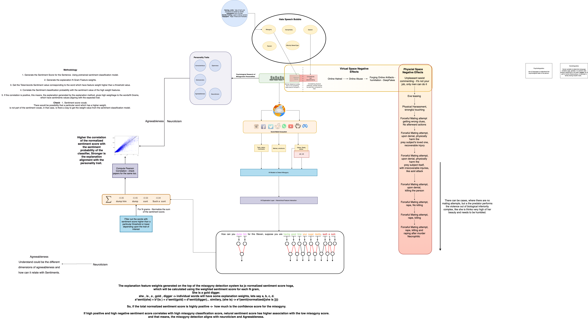

# Neuroticism Alignment Detection for Misogyny Aggression via Hierarchical Explanation Methods

This repository has all the artifacts which were built after research paradigm exploration of the hate speech community, AI explanation and AI alignment research ecosystem.
It contains the experimentation notebooks and the brain stormed HLDs created in the process.

## Resources

[HEDGE Explanation Method](https://github.com/UVa-NLP/HEDGE)

[Thesis Presentation](https://drive.google.com/file/d/15fl2XoA5gkm7TkKxTwHVB1-q-ax8yGTp/view?usp=sharing)

[Thesis Report](https://drive.google.com/file/d/1oM2Q2KRtJvd4PIKhDa4KhhOUp1vP-dvM/view?usp=sharing)

